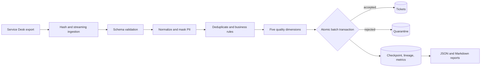

# Support Data Quality Pipeline

[](https://github.com/German4341374/support-data-quality-pipeline/actions/workflows/quality.yml)
[](https://www.python.org/)
[](https://www.postgresql.org/)
[](LICENSE)

A streaming, resumable pipeline that validates Service Desk exports, masks common PII, measures data quality, quarantines rejected rows, and loads trusted records into PostgreSQL. It is designed as a local DevOps/data-engineering portfolio project with deterministic demonstrations and no cloud account.

## What it demonstrates

- CSV, JSON Lines, and Parquet ingestion without loading a complete file into memory
- strict Pydantic schema validation and configurable YAML business rules
- normalization, deterministic ticket deduplication, and email/phone masking
- completeness, uniqueness, validity, consistency, and timeliness scores
- transactional checkpoints, automatic resume, input/config hashes, and lineage
- idempotent reruns and timestamp-aware incremental upserts
- masked quarantine records, dry runs, JSON/Markdown reports, and a quality gate
- deliberate fault injection and tested recovery after a committed batch
- pinned Python/PostgreSQL container versions, non-root execution, and an internal network
- Ruff, mypy, Pytest, coverage, package builds, container smoke tests, and GitHub Actions

## Architecture



The PostgreSQL transaction is the consistency boundary: target writes, quarantine rows, deduplication keys, counters, quality totals, and checkpoint movement commit together. See [architecture](docs/architecture.md) and [checkpoint semantics](docs/checkpoint-semantics.md).

## Stack

Python 3.12, Typer, Pydantic 2, PyArrow, Psycopg 3, PostgreSQL 18, Docker Compose, Pytest, Ruff, and mypy. Dependencies are locked in `uv.lock`; important container tags and the PostgreSQL image digest are pinned.

## Prerequisites

- Windows 11 with WSL2, or Linux
- Docker Engine with Docker Compose v2
- GNU Make for the shortcut commands
- `uv` 0.11.7 for host-side development

No AWS account, paid service, or real Service Desk export is required.

## Quick start

```bash
git clone https://github.com/German4341374/support-data-quality-pipeline.git
cd support-data-quality-pipeline
make setup
# Change POSTGRES_PASSWORD in .env before any shared or long-lived environment.
make up
make demo
make run
```

`make demo` creates 10,000 deterministic JSON Lines records under ignored `data/`. `make run` processes them in incremental mode and writes ignored reports under `artifacts/<run-id>/`.

Use only containers if Python is not installed on the host:

```bash
cp .env.example .env
docker compose up -d database
docker compose --profile tools run --rm pipeline migrate
docker compose --profile tools run --rm pipeline generate-demo data/demo.parquet --format parquet --records 100000
docker compose --profile tools run --rm pipeline run data/demo.parquet --incremental
```

## CLI

```text
support-data-quality generate-demo OUTPUT --format [csv|jsonl|parquet] --records 100000
support-data-quality migrate
support-data-quality run INPUT --config config/rules.example.yaml
support-data-quality run INPUT --dry-run
support-data-quality run INPUT --incremental
support-data-quality report RUN_ID
support-data-quality quarantine RUN_ID --limit 50
```

The exit code is `0` when processing and its quality gate succeed, `2` when processing completes below the configured threshold, and non-zero on an operational failure.

### Resume after failure

Inject a failure after two committed batches, then repeat the command without fault injection:

```bash
docker compose --profile tools run --rm pipeline run data/demo.jsonl --incremental --fail-after-batches 2
docker compose --profile tools run --rm pipeline run data/demo.jsonl --incremental
```

The second invocation finds the failed run by input/config identity and starts after its durable row offset. A completed invocation returns its existing run and does not change counters or target rows.

## Configuration

Copy `config/rules.example.yaml` and version it with the code. It controls batch size, source identity, stable reference time, freshness window, quality threshold, required fields, canonical status/priority values, and normalization mappings. A canonical configuration hash is part of every run identity.

`reference_time` is deliberately explicit instead of using the wall clock. Identical input and configuration therefore receive reproducible timeliness scores.

## Verification

```bash
make lint
make typecheck
make test-unit
# Requires DATABASE_URL pointing at a disposable PostgreSQL database:
make test
uv build
docker compose config --quiet
./scripts/smoke.sh 100
```

The CI quality workflow runs all tests against an isolated PostgreSQL service, enforces 80% branch-aware coverage, builds the Python package, builds the runtime container, and executes a 100-record database smoke test. The manual benchmark workflow uploads raw measured artifacts.

## Database verification

```bash
docker compose exec database psql -U pipeline -d support_quality -c \
  "SELECT status, total_records, loaded_records, quarantined_records FROM pipeline_runs ORDER BY started_at DESC;"
docker compose exec database psql -U pipeline -d support_quality -c \
  "SELECT dimension, round(score::numeric, 4) FROM quality_metrics ORDER BY dimension;"
docker compose exec database psql -U pipeline -d support_quality -c \
  "SELECT source_system, count(*) FROM tickets GROUP BY source_system;"
```

## Quarantine workflow

Rejected records keep their source row number, masked raw payload, lineage, and violation codes. They never enter `tickets`. Operators correct the source or versioned rules, dry-run a new immutable file, and retain the original run for audit. Follow the [quarantine runbook](docs/quarantine-runbook.md); quarantine data can still be sensitive and requires restricted access.

## Security decisions

- Source files, `.env`, reports, database volumes, and quarantine exports are ignored by Git.
- Containers run as UID/GID 10001, drop Linux capabilities, use `no-new-privileges`, and place PostgreSQL on an internal network.
- Email addresses become stable SHA-256-derived aliases; phone-like values are replaced before persistence.
- SQL values use Psycopg parameters. Migrations are checksum protected and serialized with an advisory lock.
- There are no embedded production passwords. `.env.example` contains a clearly local placeholder that must be changed.
- Masking is defense in depth, not anonymization. Custom fields require review and may need new masking rules.

## Exactly-once and other limitations

The project provides effectively-once PostgreSQL effects for an immutable local file and fixed configuration. It cannot guarantee end-to-end exactly-once across the filesystem and database. Replacing a file between hashing and reading, remote object mutation, or independent downstream side effects require stronger production controls. See [exactly-once limitations](docs/checkpoint-semantics.md).

Other deliberate limitations:

- one fixed Service Desk ticket shape, not a general schema registry
- UTF-8 CSV/JSON Lines inputs; encoding detection is out of scope
- in-run deduplication uses source system plus ticket ID, not fuzzy matching
- local filesystem reports have no transactional coupling to PostgreSQL
- no scheduler, UI, identity provider, or distributed workers
- PII detection covers common emails and phone patterns, not arbitrary sensitive text

Schema changes are handled through additive database migrations and a versioned rule document; see [schema evolution](docs/schema-evolution.md).

## Performance

No throughput is claimed without a real run. The manual benchmark uses the production container and PostgreSQL, persists raw command output, and records runner/context metadata. The current evidence and reproduction procedure live in [the performance report](docs/performance-report.md).

## Troubleshooting

- **Database connection refused:** wait for `docker compose ps` to show `database` healthy and verify `DATABASE_URL` uses `database` inside Compose or `localhost` from WSL/Linux.
- **Quality gate exits with code 2:** processing completed; inspect the dimension scores and masked quarantine sample.
- **Applied migration changed:** restore the historical SQL and create a new numbered migration.
- **A failed run does not resume:** confirm both input bytes and rule configuration are unchanged; either change intentionally creates a new run identity.
- **Permission errors in mounted folders:** ensure WSL owns `data/` and `artifacts/`, then avoid running Docker commands with `sudo`.
- **Port 5432 is busy:** stop the conflicting local PostgreSQL instance or change the host-side port mapping.

## Repository map

```text
src/support_data_quality/  CLI, readers, rules, masking, orchestration, storage
migrations/                checksum-protected PostgreSQL schema
config/                    versioned rule examples
tests/                     unit and real-PostgreSQL integration tests
scripts/                   smoke and measured benchmark workflows
docs/                      architecture, semantics, evolution, and runbooks
.github/workflows/         quality and manually dispatched benchmark automation
```

## Future improvements

- immutable object-storage inputs with version IDs and seekable checkpoints
- schema registry plus version-specific adapters
- weighted dimensions and per-field quality profiles
- a transactional outbox for downstream publication
- configurable retention and quarantine approval workflows
- OpenTelemetry traces and Prometheus metrics for long-running deployments

## Interview talking points

1. Why the atomic unit is a batch rather than a full file or individual row.
2. How an input hash and canonical configuration hash make reruns reproducible.
3. Where exactly-once ends and idempotent/effectively-once behavior begins.
4. Why a fixed reference time matters for deterministic timeliness scoring.
5. How incremental upserts prevent older exports from overwriting newer tickets.
6. Why masked quarantine still needs strict access controls.
7. How fault injection verifies recovery instead of merely documenting it.

## License

[MIT](LICENSE)
