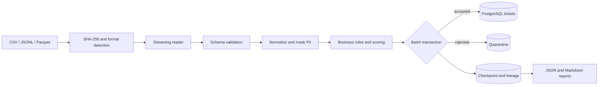

# Architecture

The command-line process reads one input at a time and produces bounded batches. Parsing and normalization are stateless. PostgreSQL owns durable coordination, deduplication, quarantine, lineage, quality metrics, and target records.

## Processing boundaries

Each batch is the consistency boundary. Ticket writes, quarantine writes, durable deduplication keys, counters, quality totals, and the checkpoint commit together. A crash before commit leaves no partial batch; a crash after commit resumes after its row offset.

CSV and JSON Lines are read one row at a time. Parquet uses row batches through `ParquetFile.iter_batches`. The generator also writes Parquet in bounded batches. Memory therefore grows with configured batch size and record width, not total file size.

## Quality dimensions

- **Completeness:** fraction of configured required fields present.
- **Uniqueness:** whether the source-system/ticket identifier has already appeared in this run.
- **Validity:** parsing, enum, date, and Pydantic schema compliance.
- **Consistency:** cross-field rules such as status versus resolution timestamp.
- **Timeliness:** update time inside the configured age window at a fixed reference time.

The overall score is the unweighted mean. Production teams can add weights in a new schema/config version rather than silently changing historical semantics.
